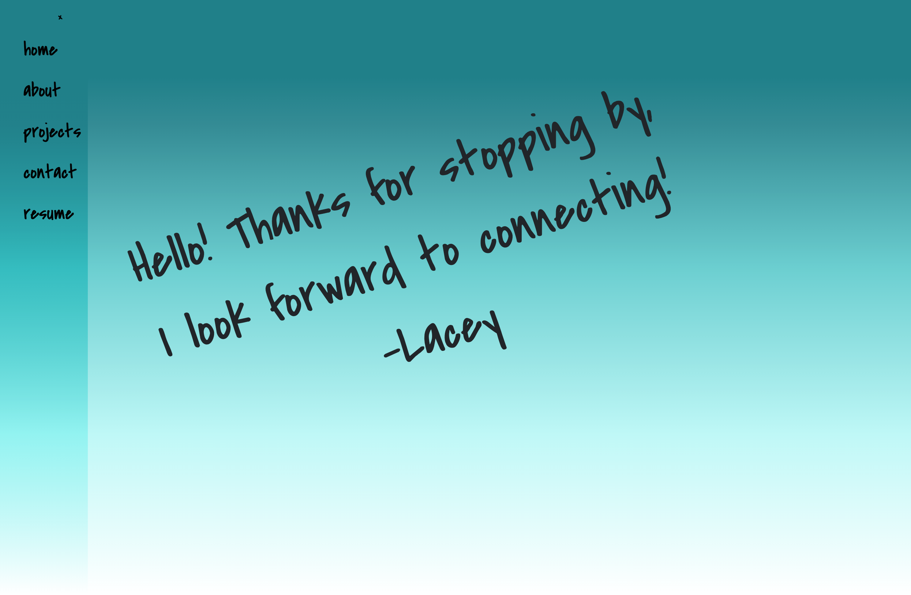
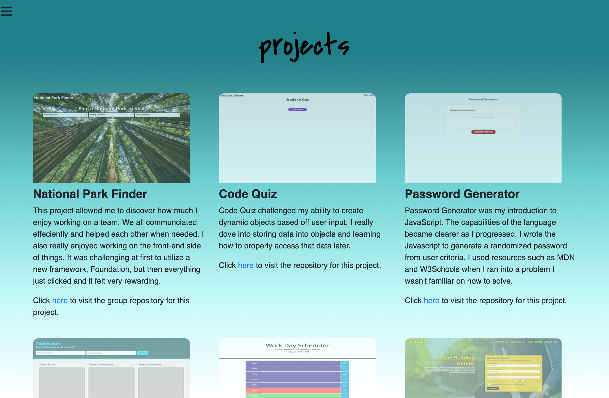

# Lacey Hay's Portfolio

## Description
This application was created to showcase my skills and experience as a Web Developer. It will be consitently updated as I learn and as I increase my deployed projects and learn new technologies.

## Technologies
*HTML
*CSS
*BootStrap
*JavaScript

## Website
https://lacey-griffith.github.io/

## Contributions
Made by Lacey Griffith

## Image

## Updates
*Added additional projects (Code Quiz, Password Generator and Work Day Scheduler) and repositories for existing and new projects
*Restructured layout, added newest project (National Park Finder), added resume
